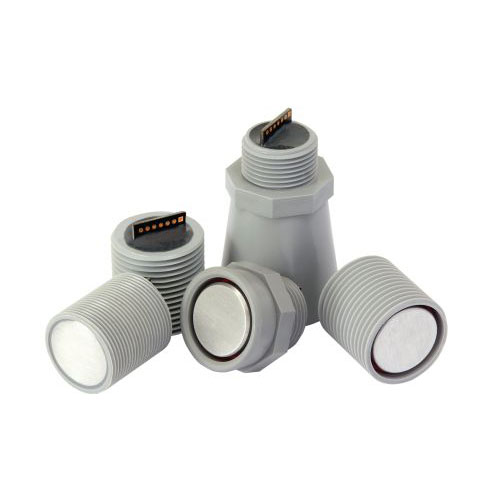
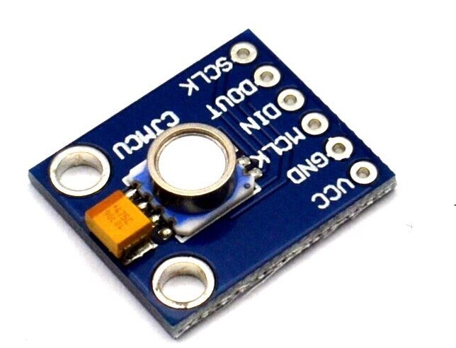
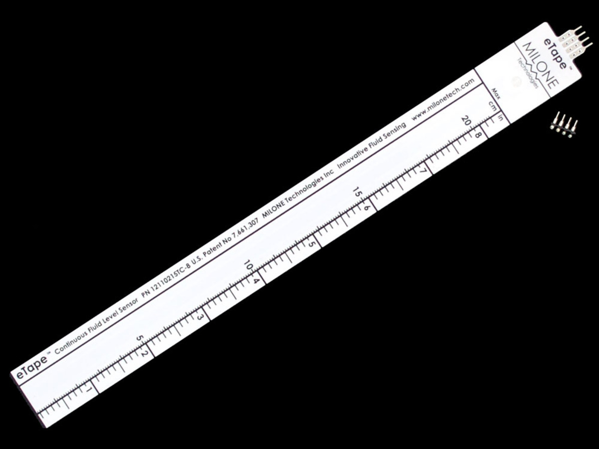
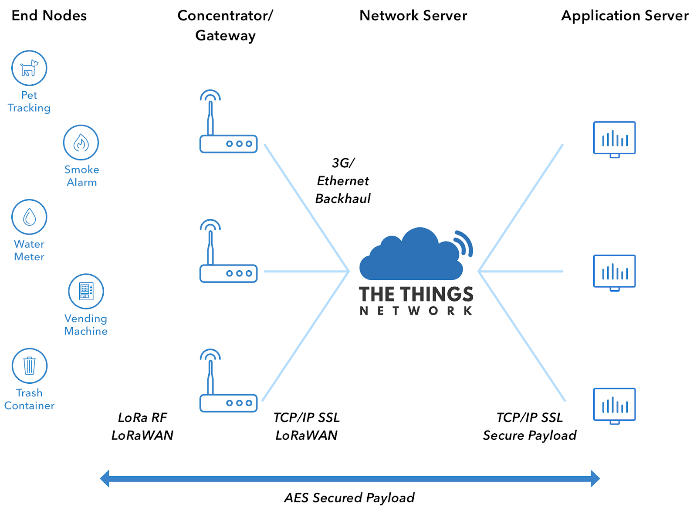

# FloodSense project sensor experiments
Place to house all reports and code related to sensor development and testing for the [Floodsense](https://wp.nyu.edu/urbanflooding/flood-sense/) project.

**Table of Contents:**

   * [FloodSense project sensor experiments](#floodsense-project-sensor-experiments)
      * [Sensor technologies](#sensor-technologies)
         * [Ultrasonic](#ultrasonic)
         * [Pressure based](#pressure-based)
         * [Resistive based](#resistive-based)
      * [Prototypes](#prototypes)
         * [Ultrasonic Prototype - v1](#ultrasonic-prototype-v1)    
      * [Experiment reports](#experiment-reports)
      * [Code base](#code-base)
         * [MCU code](#mcu-code)
         * [Analysis code](#analysis-code)
      * [LoRa](#lora)
         * [TTN Payload Decoder](#ttn-payload-decoder)

## Sensor technologies

### Ultrasonic
Ultrasonic sensors measure the distance to an object by measuring the time difference between sending a signal and receiving an echo from the object. Some options of waterproof Ultrasonic sensors are:

| Model  | Link |
| ------------- | ------------- |
| Maxbotix ultrasonic sensors <br />   | [here](https://www.maxbotix.com/Ultrasonic_Sensors.htm)  |
| ULS ultrasonic sensor <br />  | [here](https://www.dfrobot.com/product-1889.html) |

### Pressure based

Pressure transducer sensors have a sensing element of constant area which responses to the force applied to this area by the fluid in contact. The output of a pressure transducer sensor is directly proportional to the measured pressure or the liquid depth.

| Model  | Link |
| ------------- | ------------- |
| Digital Pressure Sensor - MS5540CM <br />   | [here](https://www.amazon.com/MS5540-CM-10-1100mbar-2-2V-3-6-Digital-Pressure/dp/B074KF8ZQQ)  |

### Resistive based

**Standard eTape Sensor:**


The standard eTape sensor is a fluid level sensor, which works on the principle of change in resistance as a result of change in the hydrostatic pressure of the fluid in which it is immersed in. The eTape sensor provides a resistive output that is inversely proportional to the level of the liquid: the lower the liquid level, the higher the output resistance; the higher the liquid level, the lower the output resistance.

| Model  | Link |
| ------------- | ------------- |
| eTape Sensor <br />   | [here](https://www.maxbotix.com/Ultrasonic_Sensors.htm)  |


## Prototypes
### Ultrasonic Prototype v1

#### Sensor Design

The sensor is of the dimensions 5.1" x 3.1" x 2.8". Using metal straight brace brackets the sensor can be mounted onto poles, walls and additional mounting hardware depending on the scenario.


<br />
<br />

The sensor uses a high-end ultrasonic range sensor, the MB7389 from Maxbotix, which provides range detection from 30-500 cm with an accuracy of ±3 mm. The sensor can be pole or wall mounted. Testing is ongoing to determine the sensors ability to ignore anomalous surface reflections. The sensor is battery powered with solar energy harvesting for extended operation. Connectivity is provided via a LoRaWAN system described in the following sections. The sensor will typically upload data every 30 mins with faster update rates when flood water is detected.

More documentation on technical details and technology transfer can be found [here](https://github.com/floodsense/sensor_experiments/blob/master/Technical-Documentation.md).

## Experiment reports

## Code base
### MCU code
Microcontroller (MCU) code for data capture, logging and transmission.

### Analysis code
Python code for analysis of data collected from prototype sensors

## LoRa
The LoRa protocol provides low bandwidth (<20kB/s) and long range data transmission (~3km urban) with low power usage (<2mA average consumption). The LoRaWAN protocol enables LoRa edge sensors to push data via LoRaWAN gateways up to online servers where the data can be analyzed, visualized and stored. The following figure shows the LoRaWAN architecture with The Things Network service provider.





### TTN Payload Decoder
```
// decoder variable contains battery and distance

function Decoder(b, port) {

  var decoded = {};

  // distance
  var distance = b[1]<<8|b[0];
  decoded.distance = distance;

  // battery
  var battery = b[3]<<8|b[2];       // battery in centi Volts
  battery = battery/1000;    // Convert to Volts

  decoded.battery = battery;

  var mode = b[4];
  decoded.mode = mode;

  return decoded;
}
```
