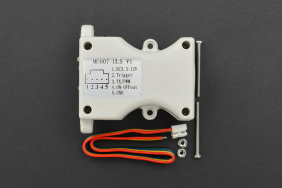
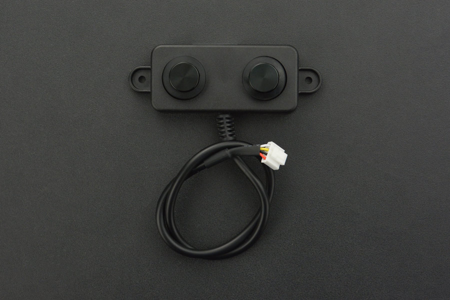

# Ultrasonic Sensors:

  Ultrasonic sensors measure the distance to an object by measuring the time
difference between sending a signal and receiving an echo from the object.

### A. Waterproof Ultrasonic sensor - ULS Model:
Datasheet: https://wiki.dfrobot.com/Water-proof%20Ultrasonic%20Sensor%20(ULS)%20%20SKU:%20SEN0300

This model is a high-performance waterproof ultrasonic sensor with three
output modes: Serial, PWM and Switch, Serial being the default mode.

#### Specifications:

#### Switching between modes:
  The default output mode of this sensor is the Serial Output mode. If not, to switch
to the serial mode short press the button once. When successfully switched, the
LED flashes blue three times, stops for 1 second and flashes three times again.

  To switch to the PWM Output mode, short press the button once. When successfully
switched, the LED flashes blue once, waits for 1 second, then flashes once again.

#### Serial Mode:
  The Serial mode uses the Serial Peripheral Interface (SPI) protocol to communicate with the microcontroller.

| Num  | Pin           | Description  |
| ---- | ------------- |--------------|
|  1   | VCC           |3.3V~12V Power input|
|  2   |  Trigger      | Trigger|
|  3   |   TX/PWM      | Serial and PWM Output |
| 4    | ON-OFF out    |  Switch Output |
| 5     |  GND         |    Ground        |

When the Trigger (Pin 2) the falling edge, the low on the trigger pin (Pin 2) is kept for 0.1 - 10ms and the controller will be triggered once with the output from the sensor on the TX/PWM pin (Pin 3). The output format is a 3.3V TTL single frame serial data with temperature compensation.

| Interface Type |	Start byte |	Data byte |	Stop byte |	Parity check	| Baud rate |
|----------------|--------------|-----------|---------- | --------------| -----------|
| Full duplex	   |     1       |	8	        |    1	    |     None      |     9600   |

**Output frame format:**

| Frame Header ID | Distance Data High	 | Distance Data Low | Temperature Data High|	Temperature Data Low	| Checksum |
|----------------|-----------------------|--------------------|---------------------| ---------------------| ---------|
| 0xFF	         |   Data_H	             |     Data_L	       |           Temp_H	    |      Temp_L	         |   SUM      |

**Distance Calculation:**

Distance=Data_H*256+Data_L (Unit: mm)

**Checksum Calculation:**

SUM=(frame header+ Data_H+ Data_L+ Temp_H+ Temp_L)&0x00FF

### B. A02YYUW Waterproof Ultrasonic Sensor:
Datasheet: https://wiki.dfrobot.com/A02YYUW%20Waterproof%20Ultrasonic%20Sensor%20SKU:%20SEN0311

This model uses Universal Asynchronous Reception and Transmission (UART) at TTL level with the following output form:

| Frame Data |	Description | Byte |
| ---------- | ------------ | ---- |
| Header	   | 0xFF         | 1 byte |
| DATA_H	|Distance Data High 8-bits|	1 byte|
| DATA_L	|Distance Data Low 8-bits	|1 byte|
| SUM	|Checksum	|1 byte|

**Distance Calculation:**
Distance= Data_H*256+ Data_L

**Checksum Calculation:**
SUM = Header + DATA_H + DATA_L

### Pin connections for serial mode
 - Maxbotix pin 4 to pin 12 of adafruit
 - Maxbotix pin 5 to pin RX of adafruit
 - VCC,GND connections have to be completed
 - Io1 to 6 on maxbotix for LORAWan
